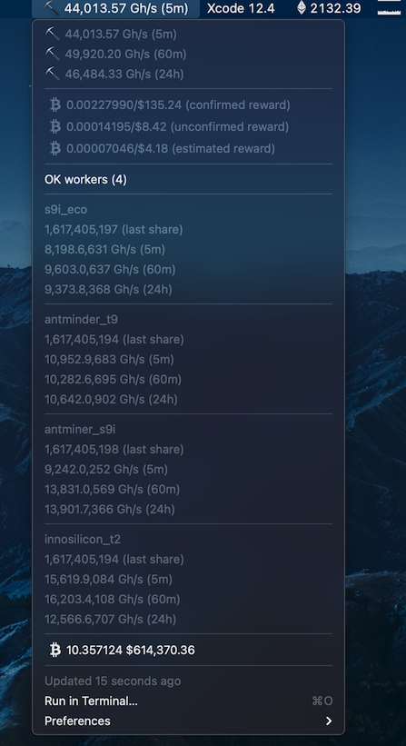

# Slushbar
### The Slushpool [Xbar](https://github.com/matryer/xbar) Monitoring Plug-in
Xbar (formerly known as Bitbar) Plugin to monitor your Slushpool mining account. The included Slushpool API key is a `LIMITED READ-ONLY` and may not work at the time you are reading this, so be sure to create your own from your own Slushpool account and replace within the script `VAR_SLUSHPOOL_API_KEY`. 

The idea of the plugin is pretty obvious, if you mine casually or professionally, you may have sophisticated software to monitor, alert, or inform you of your progress. Slushpool created its [Slushpool APIs](https://help.slushpool.com/en/support/solutions/articles/77000433512-api-configuration-guide) to provide users information about Pool, User Profile, or Worker Stats. Instruction on how to generate your Access Key is provided in the aforementioned guide. This Bitbar, err Xbar plugin, provides macOS menu bar quick view access to the status of your total hash rate, OK workers, details about your OK workers and your confirmed/unconfirmed/expected rewards in BTC and USD. If one of your workers is down, this will be presented to you in the menubar. Of course, you can take this script and extend it to send Pushover events or other such notification schemes in the event your worker is acting up. 

I was surprised that there was not already a Slushpool Bitbar plugin already, now it does, the slowest and most painful way of watching your workers earn $50. You are welcome. Slushpool Xbar plugin looks like this, at least, right now on my machine...



_I don't have a half million in BTC, obviously this is sample data._
### Slushpool API Key with LIMITED READ-ONLY permissions
~~The plugin requires an environment variable VAR_SLUSHPOOL_API_KEY, the example read-only key `Zm1oK8hGaDExOBaE` is provided as an example, however as previously mentioned likely has been disabled.~~ As stated previously, Slushpool API link to generate an access key and replace the scripts `SLUSHPOOL_API_KEY` with your own. Given the already buggy/error-prone use of Javascript with X-bar, I left out anything which would require a dependency including the npm module `bitbar` and dot.env for the API KEY, just be sure to select in Access Profiles `LIMITED READ-ONLY.

### Features
While the API access provides you with endpoints described below, I access `profile` and `worker` you may want to access others, go for it. Better and more reliable information is at the aforementioned Slushpool URL but while I wrote the plugin, the below served as notes for me, so I left them here. The file `[slushpool.js](./slushpool-api.js) was also used as sort of a test structure file. The other file conforming to the Xbar timing format is what I used/added to the plug-in repo.

### Pool Stats API
`https://slushpool.com/stats/json/[coin]/`

### User Profile API
`https://slushpool.com/accounts/profile/json/[coin]/`

### Worker API
`https://slushpool.com/accounts/workers/json/[coin]/`

### Example
`https://slushpool.com/accounts/workers/json/btc/`

```bash
curl https://slushpool.com/accounts/profile/json/btc/ -H "SlushPool-Auth-Token: Zm1oK8hGaDExOBaE"
curl https://slushpool.com/accounts/workers/json/btc/ -H "SlushPool-Auth-Token: Zm1oK8hGaDExOBaE"

```
### User Profile Output

```json
{
    "username": "markep",
    "btc": {
        "confirmed_reward": "0.00144336",
        "unconfirmed_reward": "0.00019718",
        "estimated_reward": "0.00004134",
        "send_threshold": "0.00500000",
        "hash_rate_unit": "Gh/s",
        "hash_rate_5m": 28203.7617,
        "hash_rate_60m": 28974.6332,
        "hash_rate_24h": 29377.1755,
        "hash_rate_scoring": 29272.1846,
        "hash_rate_yesterday": 29633.6409,
        "low_workers": 0,
        "off_workers": 1,
        "ok_workers": 3,
        "dis_workers": 1
    }
}
```

### Worker Output

```json
{
  'markep.[auto]': {
    state: 'dis',
    last_share: 1616202341,
    hash_rate_unit: 'Gh/s',
    hash_rate_scoring: 0,
    hash_rate_5m: 0,
    hash_rate_60m: 0,
    hash_rate_24h: 0
  },
  'markep.antminder_t9': {
    state: 'OK',
    last_share: 1617184681,
    hash_rate_unit: 'Gh/s',
    hash_rate_scoring: 10500.4893,
    hash_rate_5m: 9640.3261,
    hash_rate_60m: 11132.968,
    hash_rate_24h: 5981.7406
  },
  'markep.antminer_s9i': {
    state: 'OK',
    last_share: 1617184678,
    hash_rate_unit: 'Gh/s',
    hash_rate_scoring: 12393.3512,
    hash_rate_5m: 11332.3428,
    hash_rate_60m: 13131.9758,
    hash_rate_24h: 13979.5378
  },
  'markep.antminer_s9i_1': {
    state: 'OK',
    last_share: 1617184679,
    hash_rate_unit: 'Gh/s',
    hash_rate_scoring: 4733.7485,
    hash_rate_5m: 5645.2621,
    hash_rate_60m: 4392.7959,
    hash_rate_24h: 4776.8809
  },
  'markep.nvidia-1080': {
    state: 'off',
    last_share: null,
    hash_rate_unit: 'Gh/s',
    hash_rate_scoring: 0,
    hash_rate_5m: 0,
    hash_rate_60m: 0,
    hash_rate_24h: 0
  }
}
```


